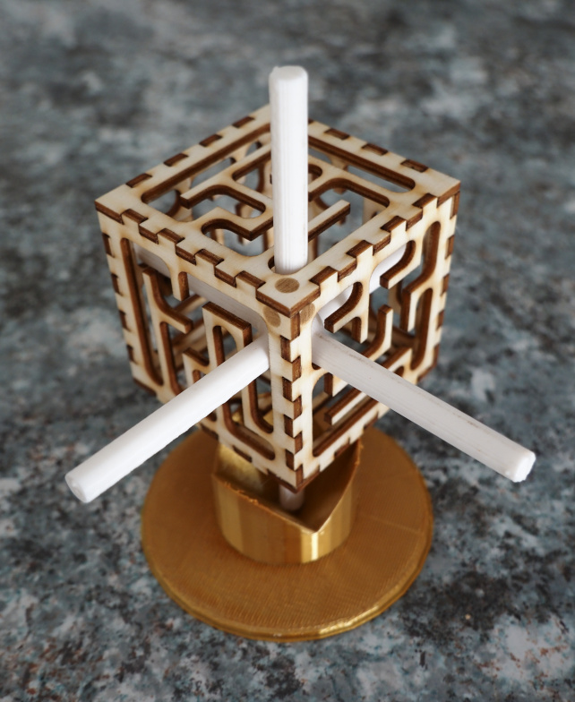
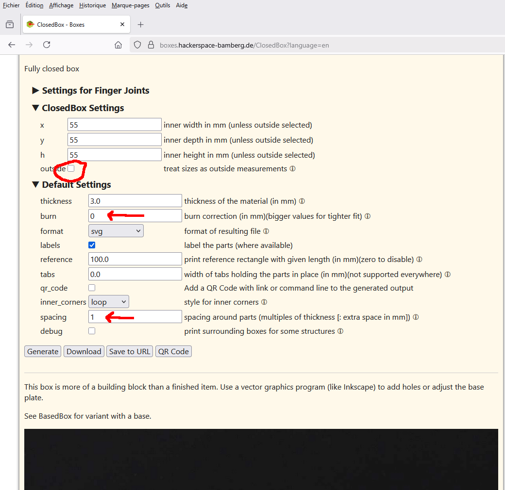
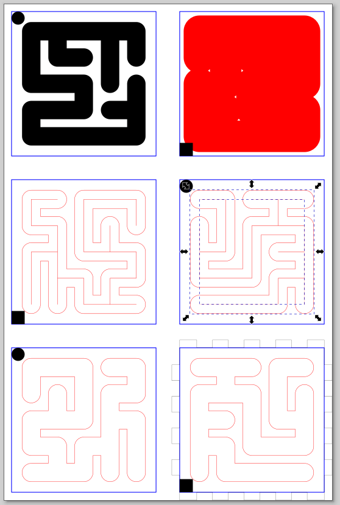

# Hybrid Maze Generator

A Python script to generate 3D mazes defined by 2D mazes cut out of cube faces. Also known as Oskar's cube maze.

## Description

This project generates a unique type of 3D maze where the maze is defined by its 2D projections on the faces of a cube. The maze can be physically constructed by laser cutting the 2D projections and assembling them into a cube. The node with 6 ways branches can be 3D printed.

Inspired by an article in "La Recherche" magazine from the late 80s, originally programmed in Turbo Pascal.
Also known as Oskar's cube maze



## Features

- Generates solvable 3D mazes with 2D projections
- Outputs SVG files for laser cutting the cube faces
- Outputs SCAD files for 3D printing navigation nodes
- Configurable maze size and branching probability
- Customizable spacing, width, and material thickness

## Requirements

- Python 3.x
- NumPy

## Installation

Clone the repository:

```bash
git clone https://github.com/Eric-FR/hybrid-maze.git
cd hybrid-maze
```

Install dependencies:

```bash
pip install numpy
```

## Usage

Run the script with default parameters:

```bash
python hybrid-maze.py
```

Or with custom options:

```bash
python hybrid-maze.py --n 7 --branching 0.05 --svg maze_faces.svg --scad navigation_node.scad --spacing 12 --width 50 --thickness 4 -v
```

### Options

- `--n`, `--size`: Maze size (default: 5)
- `--branching`: Branching probability (default: 0.01)
- `--svg`: Output SVG filename (default: ./maze.svg)
- `--scad`: Output SCAD filename (default: ./node.scad)
- `--spacing`: Corridor spacing in mm (default: 10)
- `--width`: Relative corridor width in percent (default: 70)
- `--thickness`: Material thickness in mm (default: 3)
- `-v`, `--verbose`: Enable verbose output

By default, the 3D path is built by going forward (in random direction) from the previous reached node. When all directions are already used, it is going backward to previous node to find an alternative way. Overall, it tends to build a maze with a straight forward path. To mitigate this behavior, the branching option try, time to time (proportional to --branching) to use another point instead of the last one. --branching=0 : no branching. --branching=1 : systematic branching.

## Output

- **SVG file**: Contains the 2D projections of the maze faces for laser cutting. Requires post-processing in Inkscape to convert paths to cut lines and add surrounding boxes.
- **SCAD file**: Contains the 6-way navigation node for 3D printing. Use OpenSCAD to generate STL files.

## Box Generation

For the physical box, use: https://boxes.hackerspace-bamberg.de/ClosedBox?language=en
Use the size of blue squares in the SVG file to set inner dimensions of the box
burn = 0 ; spacing = 1



## Post-treatment

- open the **SVG file** in Inkscape.
- select a path.
- convert "Stroke to Path".
- set Fill to No paint.
- set Red color to Stroke paint.
- set Stroke style Width to 0.1 mm
- Ungroup.
- remove remaining inner path.
- repeat for each face.
- merge with the box generated at the previous step.
- save the **SVG file** and go to laser machine.



## License

This program is free software: you can redistribute it and/or modify it under the terms of the GNU General Public License as published by the Free Software Foundation, either version 3 of the License, or (at your option) any later version.

This program is distributed in the hope that it will be useful, but WITHOUT ANY WARRANTY; without even the implied warranty of MERCHANTABILITY or FITNESS FOR A PARTICULAR PURPOSE. See the GNU General Public License for more details.

You should have received a copy of the GNU General Public License along with this program. If not, see <https://www.gnu.org/licenses/>.

## Contributing

Contributions are welcome! Please feel free to submit a Pull Request.

## References

- YouTube video: https://www.youtube.com/watch?v=G02t4F2opCU